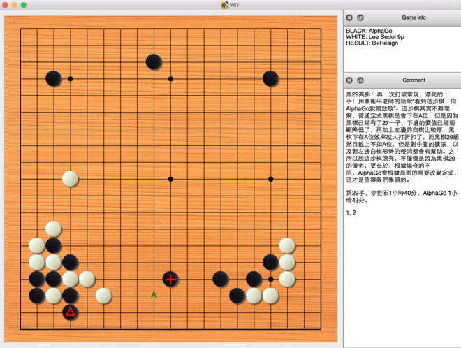

Python based SGF parser + simple game review GUI.

Currently support SGF with branch.

Tygem GIB file game records are supported as well through [gib2sgf](https://github.com/wzhliang/gib2sgf)

# Dependencies
* Python2
* PyQt
* pyparsing

# Screenshot

^^^
